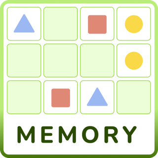
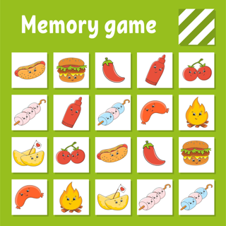

**Overview**
* Concentration (Memory Game) is a game in which all of the cards are laid face down on a surface and two cards are flipped face up and over during each player(s) turn. The object of the game is to turn over pairs of matching cards.
Concentration can be played with any number of players or as a solitaire game. It is a particularly good game for young children, though adults may find it challenging and stimulating as well. The scheme is often used in quiz shows (in fact, several game shows have used its name in their titles) and can be used as an educational game.

**User Stories**

As a user, I want the ability to...

* choose two cards and turn them face up.
* if they are of the same kind and color they get erased.
* if they are not the same they are turned down again.
* in this game you need to find all the matching pairs to win.
* you have three tries to find the six pairs.

the game ends after the last pair is picked.
Concentration is not limited to playing cards. Many versions of the game that are designed for children may have different themes. In some computer versions, the cards may randomly move to increase the difficulty.

**Bonus Stories**

(If time is available)
* better layout
* fancier cards
* have the cards move place randomly after a mismatch pick.

**Wireframes**

